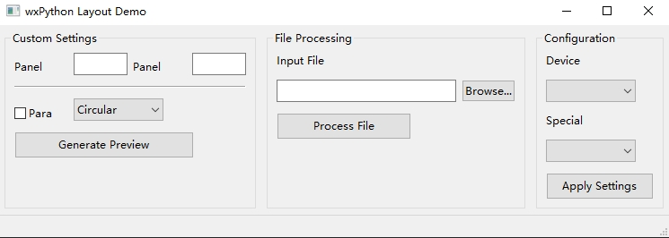

# wxPythonSimple
A Simplified wxPython Wrapper (Inspired by PySimpleGUI)



## Demo code

```
from wxSimpleGUI import SimpleStaticSizer, SimpleSizer, SimpleApp, utils
import wx

# Sample data for demo purposes
ic_types = ['type_a', 'type_b', 'type_c', 'type_d']
special_options = ['none', 'option1', 'option2']

# Initialize application
app = SimpleApp(title="wxPython Layout Demo")
app.frame.CreateStatusBar()

# Create panel
panel = app.panel

# Custom Settings Area
custom_settings = [
    [wx.StaticText(panel, label="Panel Height"), wx.TextCtrl(panel, name="panel_height"), wx.StaticText(panel, label="Panel Width"), wx.TextCtrl(panel, name="panel_width")],
    [wx.StaticLine(panel, style=wx.LI_HORIZONTAL)],
    [wx.CheckBox(panel, label="Para", name="check_corner"), wx.ComboBox(panel, choices=["Circular", "Power Curve"], value="Circular", size=(100, -1), style=wx.CB_READONLY, name="corner_type")],
    [wx.Button(panel, label="Generate Preview", size=(200, 30), name='generate_btn')]
]

# File Processing Area
file_processing = [
    [wx.StaticText(panel, label="Input File")],
    [wx.TextCtrl(panel, size=(200, -1), name="input_file"), wx.Button(panel, label="Browse...", name="browse_btn")],
    [wx.Button(panel, label="Process File", size=(150, 30), name='process_btn')]
]

# Configuration Area
config_area = [
    [wx.StaticText(panel, label="Device Type")],
    [wx.ComboBox(panel, choices=ic_types, size=(100, -1), style=wx.CB_READONLY, name="device_type")],
    [wx.StaticText(panel, label="Special Options")],
    [wx.ComboBox(panel, choices=special_options, size=(100, -1), style=wx.CB_READONLY, name="special_options")],
    [wx.Button(panel, label="Apply Settings", size=(120, 30), name='apply_btn')]
]

# Create sizers for each section
settings_sizer = SimpleStaticSizer(panel, "Custom Settings")
processing_sizer = SimpleStaticSizer(panel, "File Processing")
config_sizer = SimpleStaticSizer(panel, "Configuration")

# Add content to sizers
settings_sizer.add_2d(custom_settings)
processing_sizer.add_2d(file_processing)
config_sizer.add_2d(config_area)

# Main layout
main_sizer = SimpleSizer(wx.HORIZONTAL)
main_sizer.add_2d([
    [settings_sizer],
    [processing_sizer],
    [config_sizer]
])

panel.SetSizer(main_sizer)
app.run()

```
